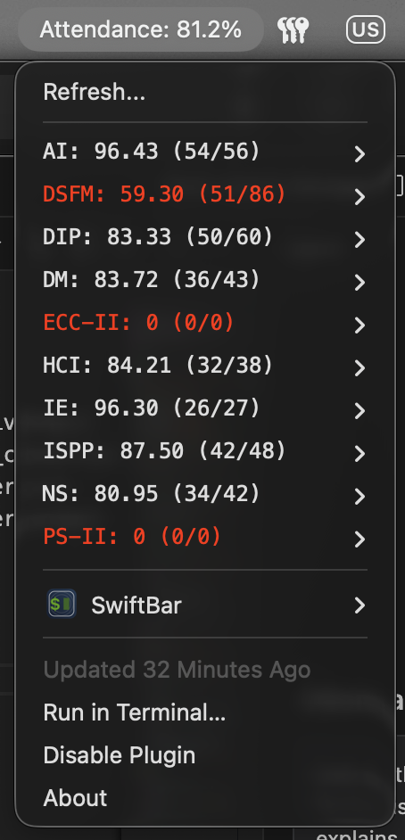

# Legacy CLI and SwiftBar

These tools predate the native iOS app. They scrape Maitri with Python and Selenium. Use the [native app](../README.md) when you can.

## Prerequisites

- Python 3.7+
- Google Chrome
- Python packages:

```bash
pip install selenium webdriver-manager colorama prettytable requests
```

## Credentials

Edit the configuration block at the top of the script you run:

```python
USERNAME = "your.email@bmu.edu.in"
PASSWORD = "YourPassword123"
```

## CLI (terminal)

From the repository root:

```bash
python attendance.py
```

### macOS and Linux alias

Add to `~/.zshrc` or `~/.bashrc`:

```bash
alias attendance="python3 /path/to/Attendance/attendance.py"
```

Reload the shell, then run `attendance`.

### Windows

Create `attendance.bat` that calls `python` on the full path to `attendance.py`, put the folder on your user `Path`, and run `attendance` from a new terminal.

## macOS menu bar (SwiftBar)

Install [SwiftBar](https://swiftbar.app) or `brew install swiftbar`.

1. Open SwiftBar and choose **Open Plugin Folder**.
2. Copy `MacOS/attendance.1h.py` into that folder. The `.1h.` suffix refreshes about every hour; use `.30m.` for thirty minutes.
3. Make it executable: `chmod +x /path/to/attendance.1h.py`
4. If SwiftBar uses the wrong Python, set the shebang to the output of `which python3`.

The menu bar shows overall attendance; the dropdown lists subjects. Low attendance rows are highlighted in red.


